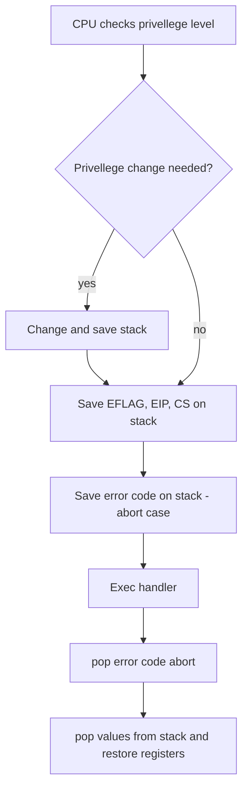

# Drivers and interrupts
This project is about building a custom linux keyboard driver that logs key presses to a temporary file and / or the kernel logs. 

# Prerequisites
## System interrupts
>An interrupt is an event that alters normal execution flow of a program and can be generated by devices or even the CPU itself. When an interrupt is occured, the execution of the program is suspended and the interrupt handler runs. The execution flow is resumed after the interrupt hander has finished executing.

There are mainly 2 **types** of interrupts
- synchronous
- asynchronous

Synchronous interrupts often called exceptions, are generated by applications while they are running. They are emitted when the processor detects certain conditions while trying to execute an application.

Asynchronous interrupts are external events generated by I/O devices, such as a keyboard stroke to alert the kernel to handle that action and resume its normal operation

Most interrupts can be maskable, which means we can postpone and delay their handlers from running for a certain time.

## Exceptions
There are 2 sources for exceptions : 
- processor detected
    - fault
    - trap
    - abort
- programmed
    - int n

Processor detected exceptions and raised when a specified / abnormal condition is met by the processor during program execution

A fault is an exception that is usually recorded before the execution of the instruction and can usually be corrected. The EIP register will store the address of the instruction that caused the fault. Once the fault is resolved, the prorgam can resume its execution

A trap is an exception that is detected after an execution of an instruction. The saved EIP is the address of the instruction after the exception is detected.

## Hardware concepts


A device which is capable of issuing interrupts has an output pin used for signallying Interrupt ReQuests. IRQ pins are connected to a device named Programmable Interrupt Controller (PIC) which is connected to CPU's INTR pin.

A PIC usually has a set of ports used to exchange information with the CPU. When a device connected to PIC needs to send an interrupt signal for the CPU to handle, the flow happens 

1. Device raises an interrupt on the corresponding IRQn pin
2. PIC converts the IRQ to a vector number and writes to a CPU port
3. PIC sends an interrupt signal to the CPU
4. PIC waits for the CPU to react to the interrupt before issuing further interrupts (scheduling)
5. CPU acknowledges interrupt and runs handler

## Interrupt handling on x86

### Interrupt descriptor table
When the vector number is written to the CPU port earlier, the CPU will read from it and refers to the Interrupt Descriptor Table to determine the type of interrupt which will affect the services being run to handle said interrupt.

Below we can find Linux IRQ vector layout. The first 32 entries are reserved for exceptions, vector 128 is used for syscall interface and the rest are used mostly for hardware interrupts handlers.


The lookup result for those numbers has 8 bytes and is called gates. There are 2 types of gates the kernel uses : 
1. Interrupt gates - holds the address of an interrupt or exception handler. These gates will prompt the PIC to start scheduling for further interrupts
2. Trap gates - similar to Interrupt Gate but does not disable other interrupts

Inside a gate, there are a few fields : 
- Segment selector, which points to the start of the code segment that handles the interrupt
- Offset, which specifies the offset for the code segment
- Type, which specifies the type of gate
- DPL, which specifies the minimum provelleges required to execute the handler.

After the handler is located, the sequence of events will happen.


## Interrupt handlers on kernel
This section describes the procedure run by the kernel when it runs the interrupt handler function.

There are 3 phases for interrupt handling
1. Critical
    - generic interrupt handler that determines interrupt number and interrupt handler lookup
    - Scheduling starts, blocking other interrupts (locks)
2. Immediate
    - device driver interrupt handler runs
    - IRQs are still blocked
3. Deffered
    - Interrupt context defferable actions (callback functions runner that executes at a later time. This mechanism decreases load in the interrupt handler) run
    - IRQs are reenabled


## Interrupt handling for drivers
**Interrupt lines** are channels opened by the kernel for drivers to read interrupts from. They are limited as the kernel can only support up to 15 - 16 of them at a time.

The following functions in `<linux/interrupt.h>` implements the interfaces
```
int request_threaded_irq(unsigned int irq, irq_handler_t handler, irq_handler_t thread_fn, unsigned long irqflags, const char * devname,
				void * dev_id);
                
```

```
void free_irq (	unsigned int irq,
 	void * dev_id);
```

`request_irq` requests for an interrupt line and  returns a status code, 0 when success. It returns `-EBUSY` when another driver is using the interrupt line that you are requesting.

`dev_name` is used in `/proc/interrupts` to indicate the owner

`dev_id` is a pointer used to chare interrupts, can point to private custom data or to a device struct.

Whenever a hardware interrupt reaches the processor, An internal coutner is incremented. The information resides in `/proc/interrupts`

It shows the IRQ number, the name and the description of the devices which are using the systems interrupt channel. If you dont see some IRQ show up, it means that the device is not in use for it is closed previously.

The `/proc/stat` file also contains (includes but not limited to) the number of interrupts the device has handled and other interrupt related information.

To determine which IRQ line to be used, the driver must first get information from various sources. if you can look at `/proc/interrupts` or you can also search for common IRQ numbers used by the device. If the device is not common, you can tell the user to give it to you upon module initialization.

Some devices 'announces' what interrupt, number they are going to use, and it is dependant on the driver to read the PCI configuration space or I/O ports to look for this signal. This action is called **probing**

There are generally 2 approaches when it comes to probing a IRQ number:

### Kernel assisted probing
Only applicable for non-shared interrupts, the driver can use these functions to determine the IRQ number
`long probe_irq_on(void)`
The function returns a botmask of unassigned IRQs. the driver must preerve the returned bit mask, and pass it to `probe_irq_off(long)` which is the "free" function for `probe_irq_on()`. It returns the nubmer of interrupts issues after calling `probe_irq_on()`.

The idea is that using these two functions, we are able to find out the available IRQ number by checking how many IRQs are left and trying to listen to interrupts and parse the unassigned bit.

### DIY probing
This method requires prerequisite knowledge on the device, where we are either hardcode the possible device IRQs or we follow the conventions found at osdev wiki.

## Reentrany and workqueues
A program can be considered reentrant if it is able to be called __safely__ before its previous call finishes execution. A reentrant program
1. Should not hold any static variables
2. Must not have any locks on singleton resources
3. Must only work on the data provided by the caller
4. Must not return static non-const data
5. Must not modify its own code
6. Must not call non-reentrant functions

Soft IRQ is a reentrant process which cannot be blocked, reschedules, interrupted by non-interrupt handler processes which is suitable for syncronized and compact tasks.

Work queues on the other hand utilizes CPU worker threads to execute the task. therefire, it supports parallalism and can be blocked and rescheduled. it is more suitable for interrupt tasks which require more time to execute or tasks which require sleeping or further deferment

## Architecture

We will have a top level **driver struct** which acts as the main struct of the driver, contains general information about driver state.
It will have 
- events_head - head of the keylog event list
- total_events - number of total events (bonus)
- task_struct - the process to interrupt, aka the current process

We will also need an **event struct** to represent a single keystroke event. The event struct will have
- scan_code - the scan code produced by the keyboards irq pin.
- is_pressed - flag wether this key is pressed or released
- name - name of the key
- time - timestamp of interrupt event
- ascii_value - ascii representation of the key
- list - kernel linked list pointer

Since we will be using workqueues to run the interrupt handlers, we will need to use a **queue_data** struct to pass data into the workqueue task
- is_shift - flag is true when shift key is held down
- is_caps - flag is true when caps lock is held down
- driver - main driver struct
- worker - container_of for workqueue function to extract data

## Implementation
Our first step is to initialize the driver struct with default values like so 
```c
drv_struct *ft_create_driver(void)
{
	drv_struct *res;

	res = 0;
	res = kmalloc(
		sizeof(drv_struct),
		GFP_KERNEL
	);
	res->total_events = 0;
	res->task = current;
	return res;
}
```

We would also need to create our first event in the linked list and store it as the head
```c
// ...

event_struct *ft_create_event(
	int scan_code,
	int is_pressed,
	char *name,
	int time,
	int ascii_value
	)
{
	event_struct *res;

	res = 0;
	res = kmalloc(
		sizeof(event_struct),
		GFP_KERNEL
	);
	res->scan_code = scan_code;
	res->is_pressed = is_pressed;
	res->name = name;
	res->time = time;
	res->ascii_value = ascii_value;
	INIT_LIST_HEAD(&(res->list));

	return res;
}
// ...
first_event = ft_create_event(-1, -1, NULL, -1, -1);
if (!first_event)
{
  ft_warn("Allocation for first event failed");
  return 1;
}
g_driver->events_head = first_event;
```

Register USB device to the kernel 
```c
static struct usb_device_id definition_table[] = {
	{USB_INTERFACE_INFO(
		USB_INTERFACE_CLASS_HID,
		USB_INTERFACE_SUBCLASS_BOOT,
		USB_INTERFACE_PROTOCOL_MOUSE
	)},
	{USB_INTERFACE_INFO(
		USB_INTERFACE_CLASS_HID,
		USB_INTERFACE_SUBCLASS_BOOT,
		USB_INTERFACE_PROTOCOL_KEYBOARD
	)},
	{0}
};
MODULE_DEVICE_TABLE(usb, definition_table);

static struct usb_driver input_driver = {
 .name = DRV_NAME,
 .id_table = definition_table,
 .probe = handle_probe,
 .disconnect = handle_disconnect,
};

int ft_register_usb(void)
{
	return usb_register(&input_driver);
}
```

Register a tmpfile to log keystrokes
```c
int ft_create_tmpfile(void)
{
	char *time;
	char *filename;
	char *prefix;

	time = ft_itoa(ktime_get_seconds());
	filename = kmalloc(69, GFP_KERNEL);
	prefix = kmalloc(69, GFP_KERNEL);
	strcpy(prefix, "/tmp/42kb");
	filename = strcat(prefix, time);
	tmpfile = filp_open(filename, O_WRONLY | O_CREAT, S_IRWXU);
	kfree(filename);
	kfree(time);
	if (tmpfile) {
		printk("Created tmpfile %s\n", tmpfile->f_path.dentry->d_name.name);
		return 0;
	}
	else
	{
		ft_warn("Cannot create tmpfile");
		return 1;
	}
}
```

Declare queue data and action. Now q_data->worker is bound to the function read_key, and everytime IRQ 1 (KB_IRQ) happens, handler function will get executed
```c
int ft_register_interrupt(void)
{
	// declare queue data
	q_data = ft_create_q_data(0, 0);
	if (!q_data)
	{
		ft_warn("Queue data creation failed\n");
		return 1;
	}
	q_data->driver = *(g_driver);
	// declare work queue action
	INIT_WORK(&(q_data->worker), read_key);
	return request_irq(KB_IRQ, &handler, IRQF_SHARED, "ft_kb", g_driver);
}
```

Define handler and read_key
```c
void read_key(struct work_struct *workqueue)
{
	int scancode = inb(KB_PORT);
	event_struct *event;

	queue_data *q_data = container_of(workqueue, queue_data, worker);

	// preprocessing
	spin_lock(&q_data_spinlock);
	q_data->is_caps = &is_caps;
	q_data->is_shift = &is_shift;
	spin_unlock(&q_data_spinlock);

	// event creation
	event = ft_generate_event(*q_data, scancode);

	// event storing
	list_add_tail(&(event->list), &(q_data->driver.events_head->list));


	// post processing (shift, caps)
	spin_lock(&q_data_spinlock);

	// if event name is caps, toggle caps
	if (!strcmp("caps", event->name) && !event->is_pressed)
		is_caps = !is_caps;
	if (!strcmp("shift", event->name))
	{
		if (event->is_pressed)
			is_shift = 1;
		else
			is_shift = 0;
	}
	spin_unlock(&q_data_spinlock);
}

irqreturn_t handler(int irq, void *dev_id){
	// call workqueue here
	schedule_work(&(q_data->worker));

	return IRQ_HANDLED;
}
```

###### tags: `kernel`
